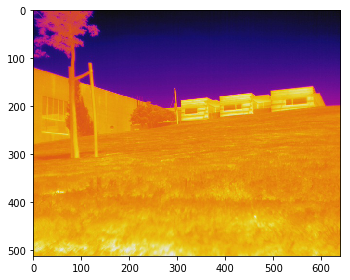
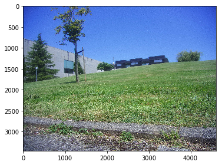
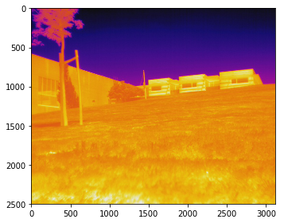
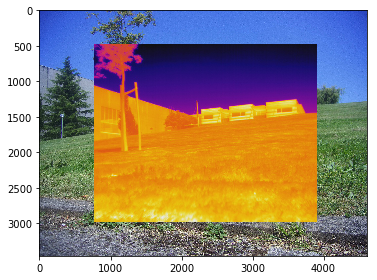

<table style="width:100%">
  <tr>
    <td></td>
    <td><font color=brown>Procesamiento de imágenes <br> de Sensores Aerotransportados y Satélite<br></font>
    <font color=green>Universidad de Oviedo. <br>Ingeniería en Geomática</font> <br><br>sgcortes@uniovi.es</td>
  </tr>
</table>

## Registro de imágenes térmicas y visibles proyecto FUO LOCIS-GOMERU APPS


```python
import skimage
import skimage.io as io
import exifread
import matplotlib.pyplot as plt
```

### Imagen Térmica


```python
# Open image file for reading (binary mode)
f = open('./matching/3casas.jpg', 'rb')
tags = exifread.process_file(f)
# print(tags)
```

    {'Image Make': (0x010F) ASCII=FLIR @ 198, 'Image Model': (0x0110) ASCII=Vue Pro 640 13mm @ 222, 'Image XResolution': (0x011A) Ratio=72 @ 182, 'Image YResolution': (0x011B) Ratio=72 @ 190, 'Image ResolutionUnit': (0x0128) Short=Pixels/Inch @ 66, 'Image Software': (0x0131) ASCII=22.20.16.1 @ 254, 'Image YCbCrPositioning': (0x0213) Short=Centered @ 90, 'Image FNumber': (0x829D) Ratio=5/4 @ 270, 'Image ExifOffset': (0x8769) Long=302 @ 114, 'GPS GPSVersionID': (0x0000) Byte=[2, 2, 0, 0] @ 1890, 'GPS GPSLatitudeRef': (0x0001) ASCII=S @ 1902, 'GPS GPSLatitude': (0x0002) Signed Ratio=[0, 0, 0] @ 2030, 'GPS GPSLongitudeRef': (0x0003) ASCII=W @ 1926, 'GPS GPSLongitude': (0x0004) Signed Ratio=[0, 0, 0] @ 2054, 'GPS GPSAltitudeRef': (0x0005) Byte=0 @ 1950, 'GPS GPSAltitude': (0x0006) Signed Ratio=0 @ 2078, 'GPS GPSTimeStamp': (0x0007) Ratio=[13, 27, 4] @ 2094, 'GPS GPSSpeedRef': (0x000C) ASCII=K @ 1986, 'GPS GPSSpeed': (0x000D) Signed Ratio=0 @ 2118, 'GPS GPSTrackRef': (0x000E) ASCII=T @ 2010, 'GPS GPSTrack': (0x000F) Ratio=0 @ 2086, 'Image GPSInfo': (0x8825) Long=1880 @ 126, 'Image FocalLength': (0x920A) Ratio=13 @ 278, 'Image FocalPlaneXResolution': (0xA20E) Ratio=272/25 @ 286, 'Image FocalPlaneYResolution': (0xA20F) Ratio=87/10 @ 294, 'Image FocalPlaneResolutionUnit': (0xA210) Short=4 @ 174, 'Thumbnail Compression': (0x0103) Short=JPEG (old-style) @ 2136, 'Thumbnail Orientation': (0x0112) Short=Horizontal (normal) @ 2148, 'Thumbnail XResolution': (0x011A) Signed Ratio=72 @ 2192, 'Thumbnail YResolution': (0x011B) Signed Ratio=72 @ 2200, 'Thumbnail ResolutionUnit': (0x0128) Short=Pixels/Inch @ 2184, 'EXIF ApplicationNotes': (0x02BC) Undefined=[] @ 412, 'EXIF ExifVersion': (0x9000) Undefined=0210 @ 324, 'EXIF ComponentsConfiguration': (0x9101) Undefined=YCbCr @ 336, 'EXIF SubjectArea': (0x9214) Short=[320, 256, 640, 512] @ 404, 'EXIF FlashPixVersion': (0xA000) Undefined=0100 @ 360, 'EXIF ColorSpace': (0xA001) Short=sRGB @ 372, 'EXIF ExifImageWidth': (0xA002) Long=640 @ 384, 'EXIF ExifImageLength': (0xA003) Long=512 @ 396}
    


```python
th = io.imread('./matching/3casas.jpg')
print(th.shape)
print(th.dtype)
print(th.max())
print(th.min())
# print(tags['Image FocalLength']) #/ mm
# print(tags.keys())
io.imshow(th);
```

    (512, 640, 3)
    uint8
    255
    0
    13
    dict_keys(['Image Make', 'Image Model', 'Image XResolution', 'Image YResolution', 'Image ResolutionUnit', 'Image Software', 'Image YCbCrPositioning', 'Image FNumber', 'Image ExifOffset', 'GPS GPSVersionID', 'GPS GPSLatitudeRef', 'GPS GPSLatitude', 'GPS GPSLongitudeRef', 'GPS GPSLongitude', 'GPS GPSAltitudeRef', 'GPS GPSAltitude', 'GPS GPSTimeStamp', 'GPS GPSSpeedRef', 'GPS GPSSpeed', 'GPS GPSTrackRef', 'GPS GPSTrack', 'Image GPSInfo', 'Image FocalLength', 'Image FocalPlaneXResolution', 'Image FocalPlaneYResolution', 'Image FocalPlaneResolutionUnit', 'Thumbnail Compression', 'Thumbnail Orientation', 'Thumbnail XResolution', 'Thumbnail YResolution', 'Thumbnail ResolutionUnit', 'EXIF ApplicationNotes', 'EXIF ExifVersion', 'EXIF ComponentsConfiguration', 'EXIF SubjectArea', 'EXIF FlashPixVersion', 'EXIF ColorSpace', 'EXIF ExifImageWidth', 'EXIF ExifImageLength'])
    





### Imagen visible


```python
# Open image file for reading (binary mode)
f = open('./matching/3casasRGB.jpg', 'rb')
tagsRGB = exifread.process_file(f)
# print(tagsRGB)
```


```python
rgb = io.imread('./matching/3casasRGB.jpg')
print(rgb.shape)
print(rgb.dtype)
print(tagsRGB['EXIF FocalLength'])
io.imshow(rgb);
```

    (3456, 4608, 3)
    uint8
    5
    





```python
frgb = 5# mm
Ps_rgb = 1.34 # micras Pixel Size	1.34µm x 1.34µm

w_rgb = Ps_rgb*rgb.shape[1]/1000
h_rgb = Ps_rgb*rgb.shape[0]/1000
print('Sensor Size RGB (mm):',w_rgb,h_rgb)
# http://www.camera-module.com/product/mipicameramodule/16mp-mipi-camera-module-sony-imx206-sensor.html
# http://www.foxeer.com/legend1.html
```

    Sensor Size RGB (mm): 6.174720000000001 4.63104
    

## Solución simple superposición

Separación entre centros de cámaras:


```python
fact_conv = 158/522 # mm/pixel
dpix_centros = 161 # pixels
dmm_centros = dpix_centros * fact_conv
print(dmm_centros)
```

    48.73180076628353
    

Tamaño ancho sensor Térmico:


```python
fth = 13 # mm
Ps_th = 17 # micras
w_th = Ps_th * th.shape[1]/1000
h_th = Ps_th * th.shape[0]/1000
print(w_th,h_th) # mm
```

    10.88 8.704
    


```python
h_th_equiv = h_th * frgb/fth
print(h_th_equiv) # mm
```

    3.347692307692308
    


```python
Altura_TH_pix = h_th_equiv/(Ps_rgb/1000)
print(Altura_TH_pix)
```

    2498.277841561424
    

El rango de píxeles en altura que ocuiparía sobre el sensor RGB la iamgen térmica sería de:


```python
hpixmax = int(rgb.shape[0]/2+Altura_TH_pix/2)
hpixmin = int(rgb.shape[0]/2-Altura_TH_pix/2)
print(hpixmax,hpixmin)
```

    2977 478
    


```python
print(hpixmax-hpixmin)
```

    2499
    

Es necesario ahora reescalar (sopbremuestrear) la imagen térmica


```python
scale = Altura_TH_pix/th.shape[0]
th_sc = skimage.transform.rescale(th, scale,multichannel=True)
print(th_sc.shape)
print(th_sc.max())
print(th_sc.min())
io.imshow(th_sc);
```

    (2498, 3123, 3)
    1.0
    0.0
    





Repetimos el cálculo en horizontal:


```python
wpixmax = int(rgb.shape[1]/2+th_sc.shape[1]/2)+36
wpixmin = int(rgb.shape[1]/2-th_sc.shape[1]/2)+36
print(wpixmax,wpixmin)
```

    3901 778
    

Superponemos las imágenes


```python
rgb_th = skimage.img_as_float(rgb)
th_sc = skimage.img_as_float(th_sc, force_copy=False)
rgb_th[hpixmin:hpixmax-1,wpixmin:wpixmax,:]=th_sc
io.imshow(rgb_th);
```





Corrección horizontal por el deplazamiento entre ejes de cámaras. La distancia medida entre ejes de cámaras es de 161 píxeles y 
la que está acotada es de 158 mm para 522 pixeles


```python
Axisdist = 161*158/522 # mm
Axisdistpix = Axisdist/Ps_rgb # num pixels
print(Axisdistpix)
```

    36.36701549722651
    


```python

```
