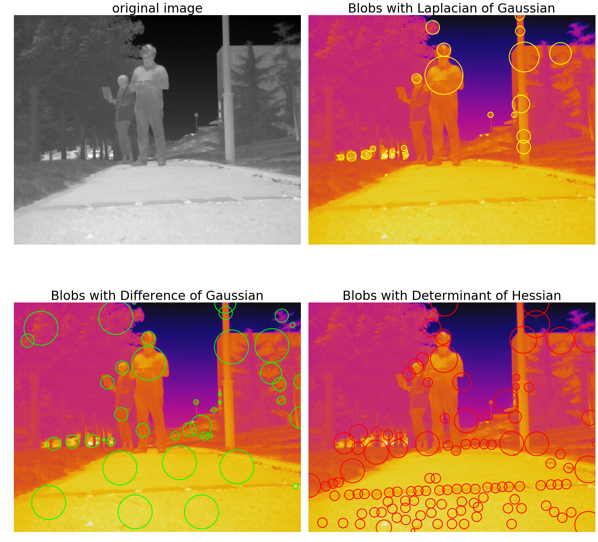

<table style="width:100%">
  <tr>
    <td></td>
    <td><font color=brown>Procesamiento de imágenes <br> de Sensores Aerotransportados y Satélite<br></font>
    <font color=green>Universidad de Oviedo. <br>Ingeniería en Geomática</font> <br><br>sgcortes@uniovi.es</td>
  </tr>
</table>

### Detectores de "manchas" (blobs)
Una mancha (o blob en inglés) es una zona clara dentro de un área mayor mas oscura y también el caso contrario (zona oscura dentro de una mas clara). En las imágenes térmicas se tiene la necesidad de la detección de estas zonas de características diferentes. Unos detectores frecuentes de blobs se basan en el operador LoG (Laplacian of Gaussian)que a su vez se emplea para detectar bordes y sus cruces por 0 (puntos de máximo o mínimo de la segunda derivada).
Dado que un blob no tiene un "tamaño definido" (es decir no se trata de un punto, el cual se bauscaría con detectores de puntos de interés, ni tiene un recorrido lineal, que podría buscarse con detectores de líneas) el planteamiento de los detectores de manchas es la búsqueda busca no sólo en el espacio 2D de la imagen, sino también en el espacio escala (aumentado mediante pirámides de imágenes construidas a partir de la imagen base original). Este espacio "3D" (posición 2d + escala) robustece la búsqueda del blob de tamaño variable aunque también lo ralentiza, especialmente en el caso de emplear el LoG que es mas exigente desde el punto de vista del cálculo (por la convolución del filtro laplaciano y el filtrado gaussiano).
Por ello se emplean también los detectores basados en DoG (Difference of Gaussians) diferencias de gaussianos como una aproximación más rápida al Laplaciano y el DoH (Determinant of Hessian) al calcular los máximos en la matriz o elcubo del Hessiano de la imagen.

### LoG, DoG, HoG
El algoritmo Log (Laplacian of Gaussian) es el mas lento y detecta solamente los blobs de tipo (blob claro sobre fondo oscuro). El DoG funciona de modo similar al LoG, y al igual que él los blobs grandes le obligan a emplear kernels grandes.
El HoG es algo diferente y detecta los blobs directos e inversos. Este método tiene problemas con los blobs pequeños menores de 3 pixels.


```python
import skimage.io as io
import skimage.color as color
import matplotlib.pyplot as pylab
from numpy import sqrt, flip
from skimage.feature import blob_dog, blob_log, blob_doh

im = io.imread('20190711_132853_R.jpg') 
im_gray = color.rgb2gray(im)

## im_gray = flip(im_gray, 1)

log_blobs = blob_log(im_gray, max_sigma=30, num_sigma=10, threshold=.1)
log_blobs[:, 2] = sqrt(2) * log_blobs[:, 2] # radio en 3a columna
dog_blobs = blob_dog(im_gray, max_sigma=30, threshold=0.1)
dog_blobs[:, 2] = sqrt(2) * dog_blobs[:, 2]
doh_blobs = blob_doh(im_gray, max_sigma=30, threshold=0.001)

list_blobs = [log_blobs, dog_blobs, doh_blobs]
color, titles = ['yellow', 'lime', 'red'], ['Laplacian of Gaussian', 'Difference of Gaussian', 'Determinant of Hessian']
sequence = zip(list_blobs, color, titles)


fig, axes = pylab.subplots(2, 2, figsize=(20, 20), sharex=True, sharey=True)
axes = axes.ravel()
axes[0].imshow(im_gray, interpolation='nearest',cmap='gray')
axes[0].set_title('original image', size=30), axes[0].set_axis_off()
for idx, (blobs, color, title) in enumerate(sequence):
 axes[idx+1].imshow(im, interpolation='nearest')
 axes[idx+1].set_title('Blobs with ' + title, size=30)
 for blob in blobs:
   y, x, row = blob
   col = pylab.Circle((x, y), row, color=color, linewidth=2, fill=False)
   axes[idx+1].add_patch(col),    axes[idx+1].set_axis_off()
pylab.tight_layout(), pylab.show();
```





```python

```
